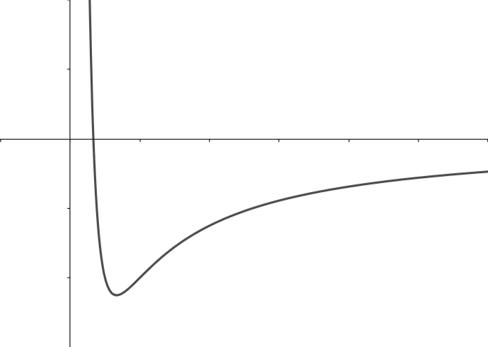

# 简单天体运动的轨迹方程、能量、角动量与开普勒三大定律

本章从理论上推导双体系统中的有关结论。

## 约化质量

假设空间中只存在两质点$S(Sun)$，$E(Earth)$，质量分别为$m_S$，$m_E$，在空间中建立一个惯性坐标系$Oxyz$，若$S$与$E$的位矢分别为$\vec{r}_S$，$\vec{r}_E$，则以$S$为参考系，$E$的相对位矢为

$\Delta{\vec{r}} = \vec{r}_E - \vec{r}_S$

上式对任意的时刻$t$均成立，于是可以同时求导得到相对速度与相对加速度

$\Delta{\vec{v}} = \vec{v}_E - \vec{v}_S,\space\space \Delta{\vec{a}} = \vec{a}_E - \vec{a}_S$

根据牛顿第三定律，若$S$受到$E$的作用为$\vec{F}_{ES}$，$E$受到$S$的作用力为$\vec{F}_{SE}$，那么有

$\vec{F}_{ES} = -\vec{F}_{SE}$

再根据牛顿第二定律有

$\vec{F}_{ES} = m_S\vec{a}_S,\space\space\vec{F}_{SE} = m_E\vec{a}_E$

于是有

$\Delta{\vec{a}} = \vec{a}_E - \vec{a}_S = \cfrac{\vec{F}_{SE}}{m_E} - \cfrac{\vec{F}_{ES}}{m_S} = \vec{F}_{SE}\cfrac{m_S+m_E}{m_Sm_E}$

定义约化质量$\mu=\cfrac{m_Sm_E}{m_S+m_E}$，则上式可以改写为

$\vec{F}_{SE}=\mu\Delta{\vec{a}}$

这表明，对于两个质点$S$，$E$的运动考察可以采用切换到其中的一个质点$S$的参考系中去并使用约化质量的巧妙方法。要格外注意，**如果我们采用约化质量的概念，那么即使其中这个质点$S$有加速度是非惯性系，我也不需要引入惯性力，而是直接按两者之间的作用力来计算相对加速度**，这大大方便了我们的计算。

## 比内公式

现在让我们更进一步考察E在S作用下在S系中的E的轨迹，方便起见位矢，速度，加速度不特殊说明的话都默认是在S系中的，令$\Delta{\vec{r}}=\vec{r}$，$\Delta{\vec{v}}=\vec{v}$，$\Delta{\vec{a}}=\vec{a}$，$\vec{F}_{SE}=\vec{F}$，由于这里只有两个质点，故可以采用以S点为极点的极坐标系描述轨迹，假设轨迹方程为$r=r(\theta)$，首先已经对于加速度有

$\vec{F}=\mu\vec{a}=\mu(\vec{a}_n+\vec{a}_\tau)$

其中$\vec{a}_n$为径向加速度，$\vec{a_\tau}$为切向加速度，由于$\vec{F}$为有心力，也就是说它的方向始终是与$\Delta{\vec{r}}$平行的，因此$\vec{a_\tau}=\vec{0}$，而又因为$\vec{a}_n=\vec{a}_r-\omega^2\vec{r}$，故有

$\vec{F}=\mu(\vec{a}_r-\omega^2\vec{r})$

标量化，则有

$F=\mu(a_r-\omega^2r)=\mu(\ddot{r}-\dot{\theta}^2r)$

$\ddot{r}-\dot{\theta}^2r=\cfrac{F}{\mu}\space\space\space\space\space(n)$

上面对于径向的信息我们进行了处理，但对于切向的信息我们还没有处理，由于$E$的角动量大小变化量$\cfrac{\mathrm{d}L_E}{\mathrm{d}t}=mra_\tau=0$，因此角动量大小$L_E=mr^2\dot{\theta}$是一个常数，若定义速度矩大小

$h=r^2\dot{\theta}\space\space\space\space\space(\tau)$

则$h$是一个常数。这样就对切向进行了处理。我们再尝试把$(n)$，$(\tau)$这两个式子代换一下，使得$r$，$\theta$能方便地求出来。令$u=\cfrac{1}{r}$运用复合函数求导法则，有

$\cfrac{\mathrm{d}u}{\mathrm{d}\theta}=\cfrac{\mathrm{d}u}{\mathrm{d}r}\cdot\cfrac{\mathrm{d}r}{\mathrm{d}t}\cdot\cfrac{1}{\cfrac{\mathrm{d}\theta}{\mathrm{d}t}}=-\cfrac{1}{r^2}\cdot\dot{r}\cdot\cfrac{1}{\dot{\theta}}=-\cfrac{\dot{r}}{\dot{\theta}r^2}=-\cfrac{\dot{r}}{h}$

$\cfrac{\mathrm{d^2}u}{\mathrm{d}\theta^2}=\cfrac{\mathrm{d}}{\mathrm{d}t}\Big(\cfrac{\mathrm{d}u}{\mathrm{d}\theta}\Big)\cdot\cfrac{1}{\cfrac{\mathrm{d}\theta}{\mathrm{d}t}}=-\cfrac{\ddot{r}}{h}\cdot\cfrac{1}{\dot{\theta}}=-\cfrac{\ddot{r}}{\dot{\theta}^2r^2}$

对于$(n)$式，等式两边同除$h^2$得到

$\cfrac{F}{\mu h^2}=\cfrac{\ddot{r}}{\dot{\theta}^2r^4}-\cfrac{1}{r^3}=-\cfrac{1}{r^2}\cdot\cfrac{\mathrm{d^2}u}{\mathrm{d}\theta^2}-\cfrac{1}{r^3}=-u^2(\cfrac{\mathrm{d^2}u}{\mathrm{d}\theta^2}+u)$

对上式变形即得到

$\boxed{\mu h^2u^2(\cfrac{\mathrm{d^2}u}{\mathrm{d}\theta^2}+u)+F=0}$

此即**比内公式**，利用该公式即可方便地求解轨迹方程了。

## 双体系统的讨论

如果上面的两个质点$S$，$E$代表两个天体的话，那么根据牛顿引力公式有

$\vec{F}=-\cfrac{Gm_Sm_E}{r^3}\vec{r}$

标量化，并带入比内公式中，即得

$\mu h^2u^2(\cfrac{\mathrm{d^2}u}{\mathrm{d}\theta^2}+u)-\cfrac{Gm_Sm_E}{r^2}=0$

记总质量$M=m_S+m_E$，上式变形为

$\cfrac{\mathrm{d^2}u}{\mathrm{d}\theta^2}+u=\cfrac{GM}{h^2}$

这是做简谐运动的谐振子的微分方程，可以直接解得通解为

$\cfrac{1}{r}=u=\cfrac{GM}{h^2}+A\cos(\theta+\phi)$

其中$A\in\R$，$\phi\in\R$仍待初值条件确定，对比圆锥曲线方程$r(\theta)=\cfrac{ep}{1+\cos(\theta+\phi)}$(其中$e$为离心率，$p$为焦准距，$\phi$控制曲线的旋转倾角，当$\phi=0$时曲线就是标准的圆锥曲线)，可以发现我们的解恰好就是这种形式的！说明**天体$E$轨迹是一条圆锥曲线，而$S$恰在曲线的一个焦点上(当轨迹为椭圆时，这就是开普勒第一定律)**，于是可以直接令$\phi=0$让曲线先“摆正”了，再设$E$处在拱点时距离$S$为$r_0$，则可带入通解求得

$A=\cfrac{1}{r_0}-\cfrac{GM}{h^2}$

带入到通解中，再与标准圆锥曲线轨迹方程对比得到

$r=\cfrac{\cfrac{h^2}{GM}}{1+\cfrac{Ah^2}{GM}\cos\theta}$

$e=\cfrac{Ah^2}{GM}=\cfrac{h^2}{GMr_0}-1$

$p=\cfrac{1}{A}=\cfrac{h^2r_0}{h^2-GMr_0}$

> ### 讨论轨道能$E$与天体轨迹的关系
>
> 当$\theta=0$时，**因为$E$位于拱点，所以只有切向速度**，规定无穷远处引力势能为0，则此时系统总能量(又称为轨道能)为
>
> $E=\cfrac{1}{2}m_E(\dot{\theta}r_0)^2-\cfrac{Gm_Sm_E}{r_0}=\cfrac{m_Eh^2-2Gm_Sm_Er_0}{2{r_0}^2}=\cfrac{Gm_Sm_E(e-1+\cfrac{m_S}{m_E}(e+1))}{2{r_0}}$
>
> 我们进行一下近似处理，当$m_S\gg m_E$时，$\cfrac{m_S}{m_E}\to0$于是近似地，有
>
> $E=\cfrac{Gm_Sm_E(e-1+\cfrac{m_S}{m_E}(e+1))}{2{r_0}}=\cfrac{Gm_Sm_E(e-1)}{2{r_0}}$
>
> $\cfrac{\mathrm{d}E}{\mathrm{d}r_0}=\cfrac{Gm_Sm_Er_0-m_Eh^2}{{r_0}^3}=-\cfrac{Gm_Sm_Ee}{{r_0}^2}$
>
> 据此可绘制出$E-r_0$大致图像图像
>
> 
>
> * 当$E>0$时，$e>1$，$E$的轨迹为**双曲线**的一支。
>
> * 当$E<0$时，$-1<e<1$，$E$的轨迹为一条**椭圆(包括圆)**，且当$e=0$时，轨道能量最低，轨道形状为标准的圆形。
>
> * 当$E=0$时，$e=1$，$E$的轨迹为一条**抛物线**。

先前我们得到速度矩的大小$h$是一个定值，注意到$E$的径矢扫过的面积速率为

$\cfrac{\mathrm{d}S}{\mathrm{d}t}=\cfrac{\cfrac{1}{2}r^2\mathrm{d}\theta}{\mathrm{d}t}=\cfrac{1}{2}r^2\dot{\theta}=\cfrac{1}{2}h$

即 $\boxed{\cfrac{\mathrm{d}S}{\mathrm{d}t}=\cfrac{1}{2}h}$

因此径矢扫过的面积的速率也是一个定值！这就是**开普勒第二定律**。

下面针对$E$的轨迹为椭圆的情况进行探讨，再适当位置建立平面直角坐标系使得轨迹方程为$\cfrac{x^2}{a^2}+\cfrac{y^2}{b^2}=1，(a>b>0)$，且有$a^2=b^2+c^2$。显然这里有$r_0=a-c$。利用先前已经推导出来离心率的表达式，又有

$e=\cfrac{h^2}{GM(a-c)}-1=\cfrac{c}{a}$

解得速度矩大小

$h=b\sqrt{\cfrac{GM}{a}}$

因为$E$轨迹为椭圆，所以设绕一圈所需时间，即周期为$T$，则根据开普勒第二定律有

$\pi ab=\int\mathrm{d}S=\int_0^T\cfrac{1}{2}h\mathrm{d}t=\cfrac{1}{2}hT=\cfrac{1}{2}b\sqrt{\cfrac{GM}{a}}T$

上式两边整理可得

$\boxed{\cfrac{T^2}{a^3}=\cfrac{4\pi^2}{GM}}$

此即**开普勒第三定律**。

> ### 沿椭圆轨道运动的轨道能与轨道角动量大小
>
> $L=m_Eh=m_Eb\sqrt{\cfrac{GM}{a}}$
>
> $E=\cfrac{Gm_Sm_E(e-1)}{2{(a-c)}}=-\cfrac{Gm_Sm_E}{2a}$
>
> 其中轨道能是**近似**的
